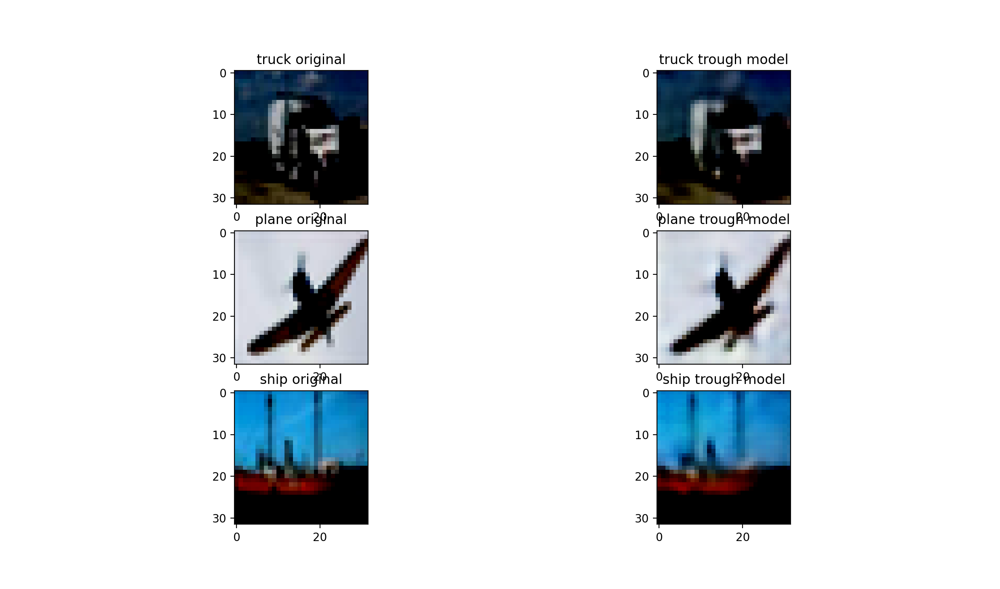
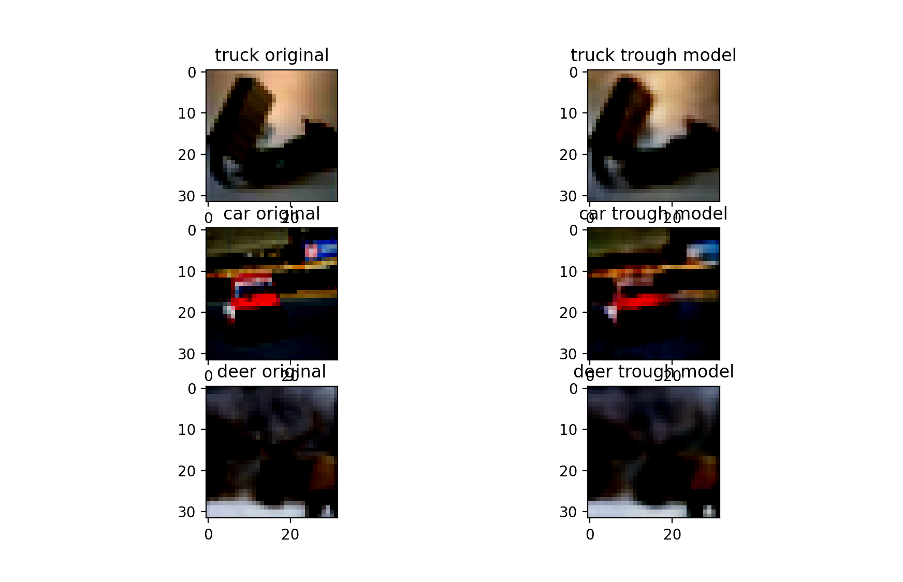

# AutoEncoder-CIFAR10

## Motivation
 I have run in to problem for finding an easy to implement AutoEncoder(AE) code for [CIFAR10](https://www.cs.toronto.edu/~kriz/cifar.html) dataset.
 
 After dozen of days to search a proper and easy to understading that how a simple autoencoder model should be implemented, I eventually decide to write it by myself. Every body knows that putting machine learning technique to learn can takes long time to finish. So I put my model, and optimizer's learned parameter to this repository too.
 
 I hope this code can be useful for everybody.
 
 ## Installation libraries and packages
 This code is written by Python program and need the following packages to be able to execute:
 
 Use the package manager [pip](https://pip.pypa.io/en/stable/) to install the following packages.
 - [pytorch](https://pytorch.org)
 - [pytorch-lightning](https://pypi.org/project/pytorch-lightning/)
 - [torchvision](https://pytorch.org)
 - [matplotlib](https://pypi.org/project/matplotlib/)
 - [argparse](https://pypi.org/project/argparse/)
 it is better to create an environment using 'venv' or 'conda' command.
 # execution
 ```
 [AE project current address]@ python main_AE --help
 optional arguments:
  -h, --help            show this help message and exit
  - dataset DATASET
  - epochs EPOCHS
  - batch_size BATCH_SIZE
  - lr LR
  - weight-decay WEIGHT_DECAY
  - load_model
  - save_model

 ```
 For instance, if you want to load pretrained model you need to use --load_model keyword after calling the file
 ```
 [AE project current address]@ python main_AE --load_model
 ```
 one example of run load model:
 
 Another model load output:
 
 
 ## Contributing
Pull requests are welcome. For major changes, please open an issue first to discuss what you would like to change.

Please make sure to update tests as appropriate.
